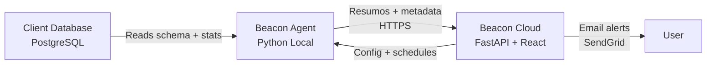

# Beacon

## Data Trust Platform

**Beacon** is a hybrid data quality platform that combines a local Python agent for statistical profiling and anomaly detection with a cloud dashboard for centralized management and alerting. 

Setup in 5 minutes. No SQL queries required.

[Get Started](about.md){ .md-button .md-button--primary }
[View on GitHub :fontawesome-brands-github:](https://github.com/ItaloSamP/Beacon){ .md-button }

---

## Dashboard

- :material-check-circle:{ .lg .middle } **Status**

    ---

    
    
    
    

- :material-shield-check:{ .lg .middle } **Why Beacon?**

    ---

    Eliminates the *silent uncertainty* about data quality — the constant fear that dashboards and reports are powered by corrupted data without anyone knowing. Beacon learns the historical baseline of each table and alerts when distributions, volumes, or schemas deviate from normal.

---

## Quick Links

- [:material-book-open-variant: **About Beacon**](about.md) — Vision, problem statement, solution, and value proposition
- [:material-handshake: **Contributing**](contributing.md) — Git workflow, PR process, Definition of Ready, Definition of Done
- [:material-application-brackets: **Architecture**](architecture.md) — Hybrid agent + cloud design, modular monolith, module organization
- [:material-code-tags: **Development**](development.md) — Stack overview, dev commands, coding conventions
- [:material-puzzle: **Features**](features.md) — Current and planned features
- [:material-docker: **DevOps & QA**](devops.md) — Sprint plans, CI/CD, quality gates
- [:material-rocket: **Releases**](releases.md) — Release notes and changelog

---

## Architecture at a Glance

**The agent never uploads raw data.** Only statistical summaries and schema metadata are sent to the cloud.

